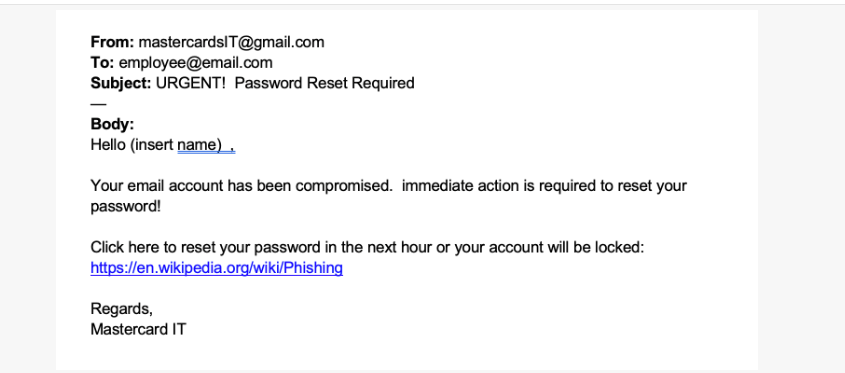
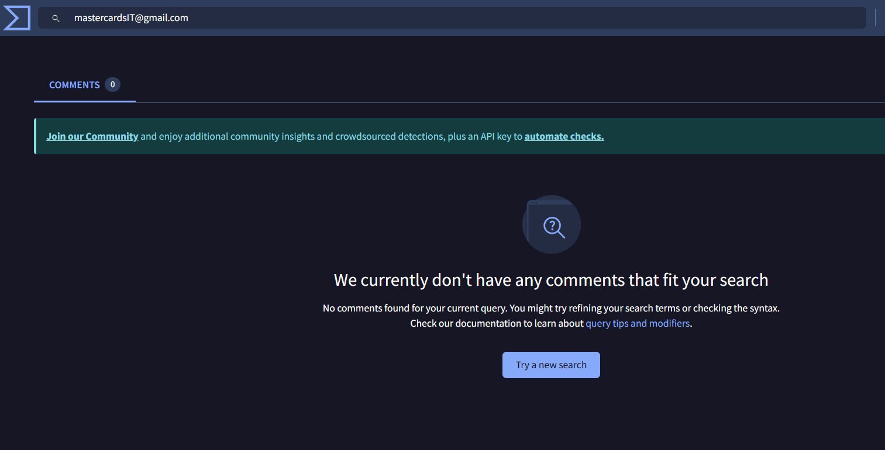
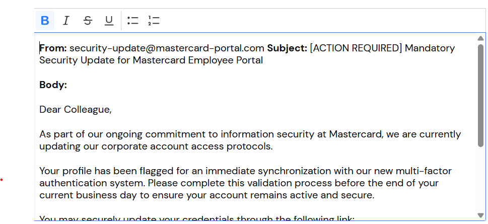
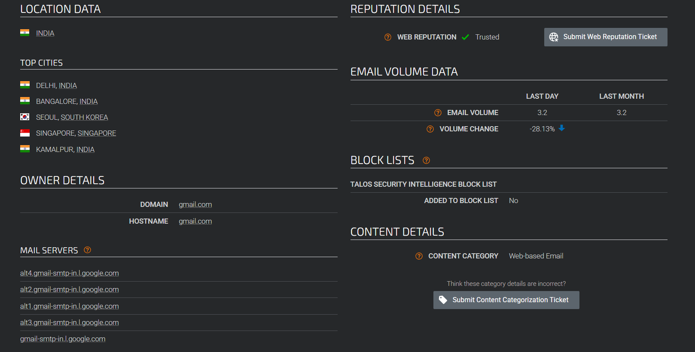
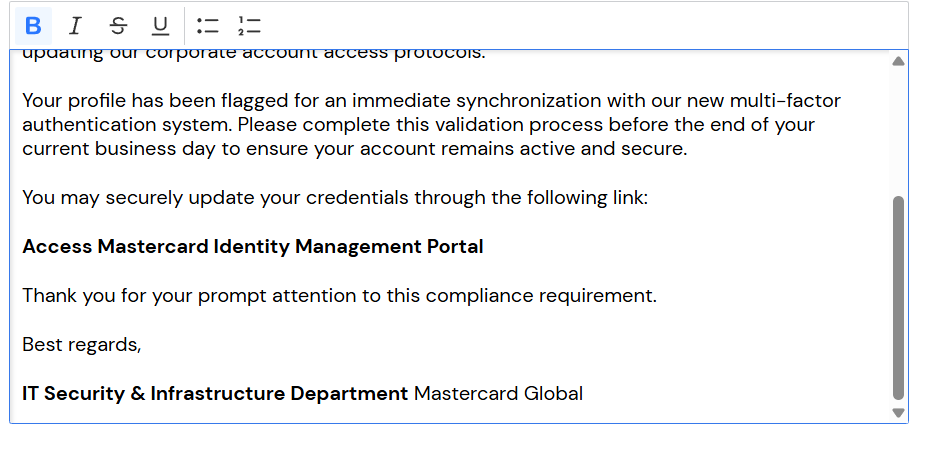

\# Reporte de Seguridad: Campaña de Phishing Real - Mastercard

\## 1. Contexto del Incidente

Hace unos meses, los sistemas de seguridad de Mastercard detectaron un ataque de phishing dirigido a los empleados. Aunque el ataque falló por ser una "falsificación evidente", se utiliza como caso de estudio para mejorar la detección de amenazas más sofisticadas.

 por: 

\## 2. Hallazgos en el Correo Detectado Original

&nbsp;A continuación se detallan las señales de alerta (\*\*Red Flags\*\*) identificadas:

*Remitente Sospechoso:* Se validó que el correo contiene una falta de ortografía en el nombre de la entidad y utiliza un dominio público (gmail.com), confirmando el intento de suplantación.

*Uso de Urgencia:* El asunto "URGENT!" y la amenaza de bloquear la cuenta en una hora son tácticas de presión para forzar una acción rápida.

*Enlace Fraudulento:* El hipervínculo para "resetear la contraseña" redirige a un sitio externo (Wikipedia) en lugar de un portal oficial de la empresa.

*Falta de Personalización:* El correo utiliza un saludo genérico "Hello (insert name)", lo que confirma que se trata de un envío masivo automatizado y no de una comunicación oficial de Mastercard.

### 🔍 Validación Técnica de IoCs (Indicadores de Compromiso) Para confirmar la naturaleza maliciosa de los hallazgos, se aplicó el siguiente flujo de análisis:

 Para confirmar la naturaleza del ataque, se aplicó un flujo de análisis técnico sobre los indicadores encontrados:

Reputación de Dominio (VirusTotal/Cisco Talos): El remitente fue categorizado como "Clean". Como analista, se determinó que esto representa un Falso Negativo táctico, ya que los atacantes utilizan dominios de alta reputación (gmail.com) y cuentas de reciente creación para evadir los sistemas de detección automatizados basados en listas negras.

Análisis de Identidad: Se confirmó la anomalía total entre la entidad suplantada (Mastercard) y el uso de una infraestructura de correo gratuita y pública, lo cual es un indicador crítico de Phishing en entornos corporativos.

Análisis WHOIS: Se verificó que el dominio del atacante carece de registros vinculados a la infraestructura oficial de Mastercard, confirmando una técnica de infraestructura descartable.

 por: 

\## 3. Fase de Diseño: Simulación de Phishing Corporativo

Tras analizar las debilidades del ataque original, se diseñó una campaña interna utilizando un remitente que simula ser oficial y un cuerpo de mensaje contextual. El objetivo es eliminar las señales de alerta obvias del primer correo para aumentar la probabilidad de que un empleado haga clic.

\### Estrategia de Mejora para la Simulación:

\* \*\*Remitente Simulado:\*\* Se reemplazó el dominio genérico de Gmail por uno que parece oficial (`security-update@mastercard-portal.com`), dificultando la detección inmediata.

\* \*\*Optimización de Redacción:\*\* Se eliminó el diseño descuidado y se utilizó un tono profesional y corporativo con ortografía y gramática correctas.

\* \*\*Aumento de Credibilidad:\*\* Se reemplazó el saludo genérico por un contexto de "cumplimiento obligatorio" sobre seguridad (MFA) y se enmascaró el enlace malicioso tras un texto descriptivo.

\## 4. Desarrollo del Correo Final (Evidencia 2 y 3)

A continuación se presenta el resultado de la simulación diseñada, aplicando las mejoras de identidad visual y técnica para hacerlo creíble:

\* \*\*From:\*\* security-update@mastercard-portal.com

\* \*\*Subject:\*\* \[ACTION REQUIRED] Mandatory Security Update for Mastercard Employee Portal

\* \*\*Link Enmascarado:\*\* \[Access Mastercard Identity Management Portal](https://en.wikipedia.org/wiki/Phishing)

 por: 

 por: 

## 5. Conclusión

El desarrollo de esta simulación permite medir la capacidad de respuesta de los empleados ante ataques de Phishing. Al corregir los errores del ataque original e incluir elementos de legitimidad como firmas de IT, contextos de cumplimiento (MFA) y avisos de confidencialidad, se crea un escenario realista que ayuda a fortalecer la cultura de ciberseguridad organizacional y a identificar áreas críticas que requieren mayor capacitación técnica.

### *Recomendaciones de Seguridad Proactiva Más allá de la capacitación, se recomienda a la organización implementar las siguientes defensas técnicas:

Protocolos de Email: Configurar y endurecer los registros SPF, DKIM y políticas de DMARC (en modo quarantine o reject) para evitar que atacantes externos puedan suplantar el dominio oficial de la empresa.

MFA (Multi-Factor Authentication): Implementar el uso de tokens físicos o aplicaciones de autenticación para mitigar el impacto en caso de que un empleado entregue sus credenciales.

